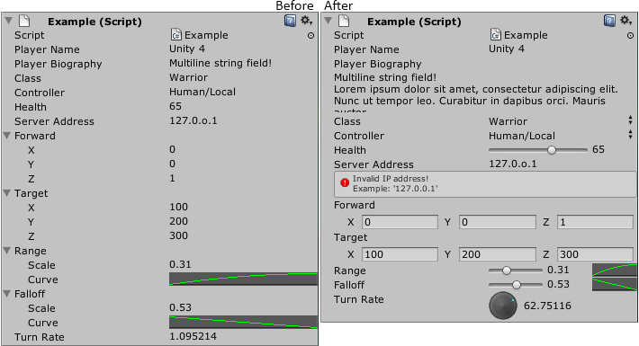

A collection of open-source Unity3D property drawers

http://blogs.unity3d.com/2012/09/07/property-drawers-in-unity-4/
http://docs.unity3d.com/Documentation/ScriptReference/PropertyDrawer.html

Property drawers are a new feature in Unity 4 to help you make custom inspectors without writing editor code. By just adding attributes to your behaviour's fields, you can turn the left image into the right:



Each directory contains one drawer, and some documentation.

##Installation

Download the zip from the ZIP button above, expand into your Assets directory.

##More Drawers

Got an idea for a drawer? No time? Suggest it in the issues page!
https://github.com/tenpn/ChestOfPropertyDrawers/issues

###Pull Requests

Pull requests more than welcome, but new drawers must be grainular enough to be of use to multiple projects.

New pull requests should be in this format:

```
AttributeName
 |- Editor
     |- PropertyDrawer.cs
 |- Attribute.cs
 |- ExampleUsage.cs
 |- readme.md
```

If you can embed pictures in your readmes, all the better.

##Other Stuff

Partially-inspired by this Japanese(?) repro:
https://github.com/anchan828/property-drawer-collection

For licensing, see [license file](license.md)
